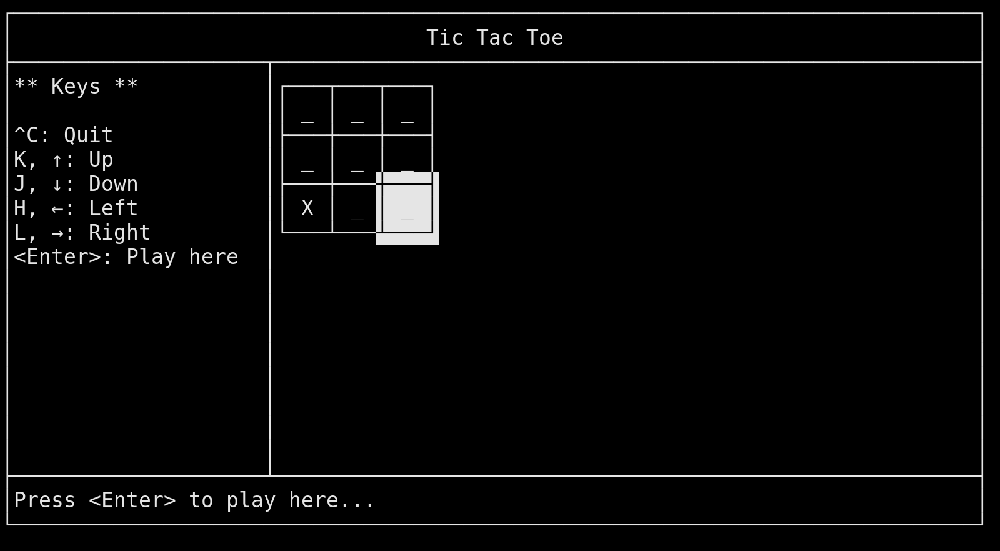

# Tic Tac Toe in Golang

This is mainly intended as an exercise in programming with [Go](https://golang.org/).
The implementation is still incomplete. This is work in progress.

## Prerequisits

- [Install Git](https://git-scm.com/)
- [Install Go](https://golang.org/)

## Installation

	$ git clone https://github.com/EsGeh/tictactoe-golang.git
	$ cd tictactoe-golang/

## Run Game

simple clone this repository into some local directory:

	$ go run .

## Run Tests

	$ go test .
